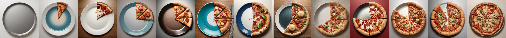
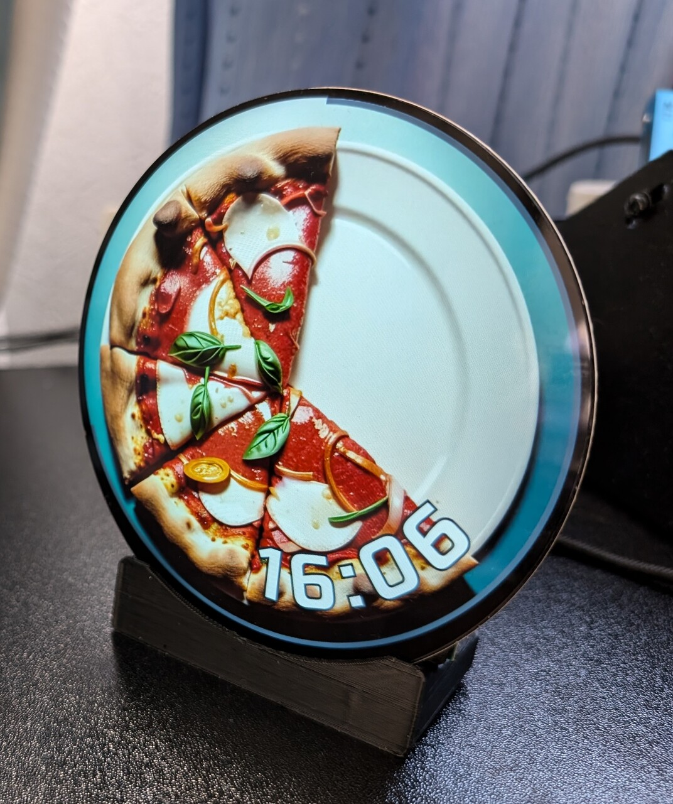
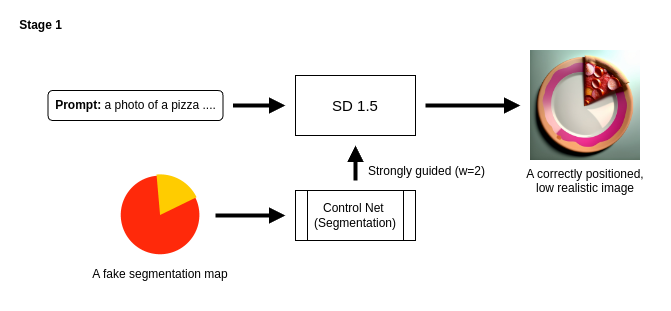
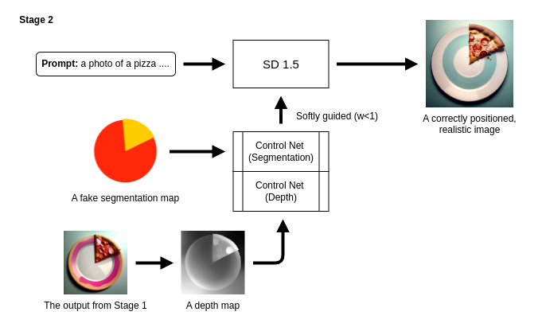
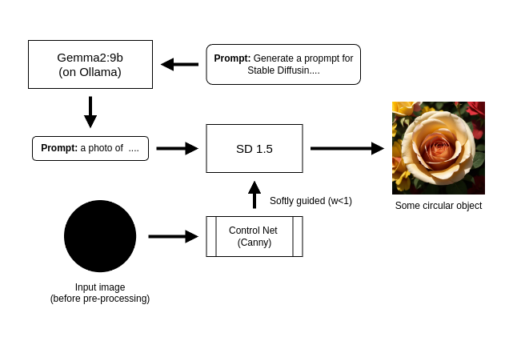
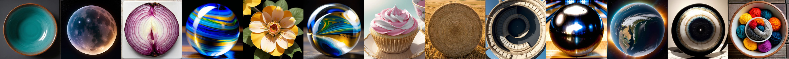
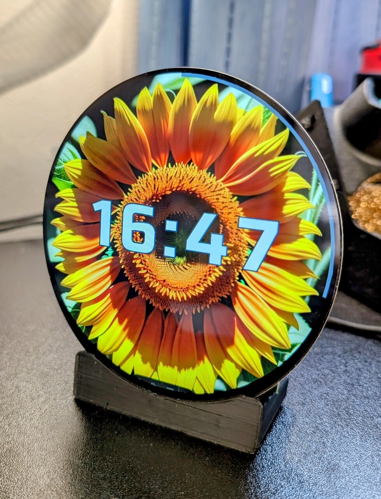
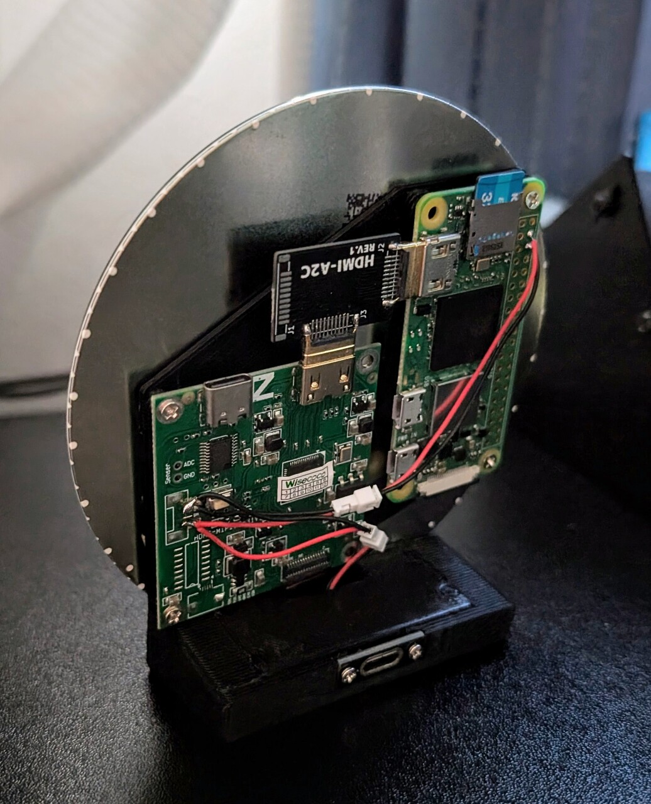

<div align="center">
  
</div>

# Pizza Clock



A simple desktop clock that displays the time using pieces of pizza.

- [Stable Diffusion](https://stability.ai/stable-image) to generate clock faces 🍕
- [NixOS](https://nixos.org/) to generate the OS image for the Raspberry Pi Zero 2 W. ❄️
- [SolidPython](https://solidpython.readthedocs.io/en/latest/) ([OpenSCAD](https://openscad.org/)) to model the case. 📐
- [Astro](https://astro.build/) + [React](https://react.dev/) to build the clock app, hosted on GitHub Pages. 🚀



## Project structure

```sh
.
├── README.md         # This file.
├── case/             # 3D-printable case. (OpenSCAD, SolidPython)
├── pizza_generator/  # Pizza image generator. (Stable Diffusion, LLM)
├── rpi_image/        # Raspberry Pi Zero 2 W image (NixOS)
└── webui/            # SSG site (Astro, React)
```

## How to generate a pizza image

To generate an image with the correct number of pizza slices, a two-stage workflow is used.

**Stage 1**: An image is generated using a relatively strong ControlNet guide strength with an artificially-generated segmentation map. The result tends to be correctly positioned but less realistic.



**Stage 2**: A depth map of the stage 1 image and the same segmentation map are used to guide image generation, but with a relatively weak ControlNet guide strength. This allows us to obtain a correctly positioned and highly realistic image.



A similar approach can be used to generate images of other "circular objects." An LLM generates a prompt for a Stable Diffusion model. This prompt, along with a segmentation map, is then used as input to generate the image.






## Photos

<div>



<video src="https://github.com/user-attachments/assets/58adc9b2-f695-4855-a670-eaf04ffb4e04" height="300px" autoplay loop muted playsinline></video>
<video src="https://github.com/user-attachments/assets/4a63d769-2950-4bcd-88dc-af705fc197b4" height="300px" autoplay loop muted playsinline></video>
</div>

<details>
<summary></summary>
<video src="https://github.com/user-attachments/assets/78d5298d-e52d-48a6-a94a-4cb9c023d65e" height="1px" autoplay loop muted playsinline></video>
</details>

# LICENSE

MIT