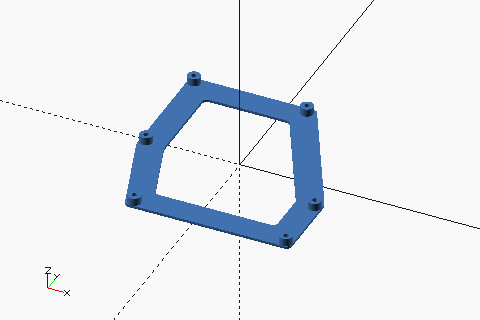
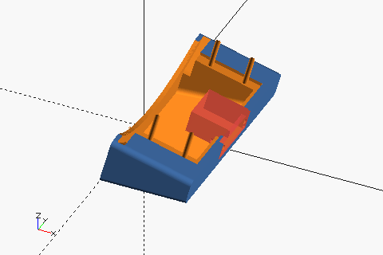
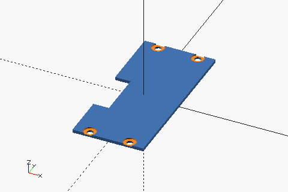

# pizza-clock/case

## Prerequisites

- Python 3.11
- uv 0.5
- OpenSCAD (nightly build) 2025.02
- GNU Make
- ImageMagick

## Build

```sh
# Install dependencies.
$ uv sync

# Generate .scad files.
$ uv run src/build.py

# Generate .scad and .stl files.
$ make all

# Generate thumbnail images.
$ make images
```

## Parts

|                                         | STL                                          |
| --------------------------------------- | -------------------------------------------- |
|     | [board_holder.stl](./board_holder.stl)       |
|      | [pizza_stand.stl](./pizza_stand.stl)         |
|  | [pizza_stand_lid.stl](./pizza_stand_lid.stl) |

## BOM

|                  Item                   | Quantity | Remarks                                                |
| :-------------------------------------: | :------: | ------------------------------------------------------ |
|              RPi Zero 2 W               |    1     |                                                        |
| 4 inch 720x720 rounding LCD (mini HDMI) |    1     | `Wisecoco 4 Inch Round LCD Display 720x720 IPS Screen` |
|       M2 4 mm self tapping screws       |    10    |                                                        |
|       M2 6 mm self tapping screws       |    2     |                                                        |
|     Mini HDMI male-to-male adapter      |    1     | [HDMI-A2C](https://github.com/likeablob/HDMI-A2C)      |
