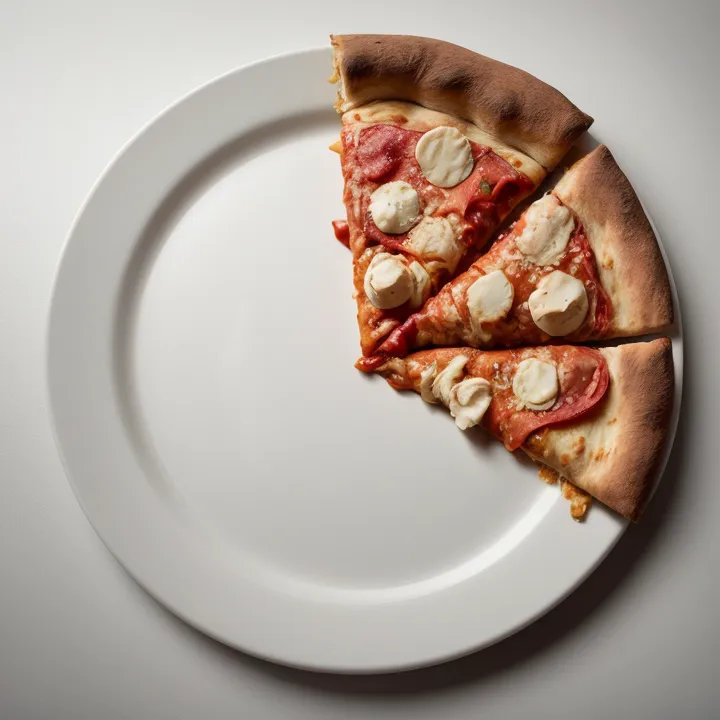
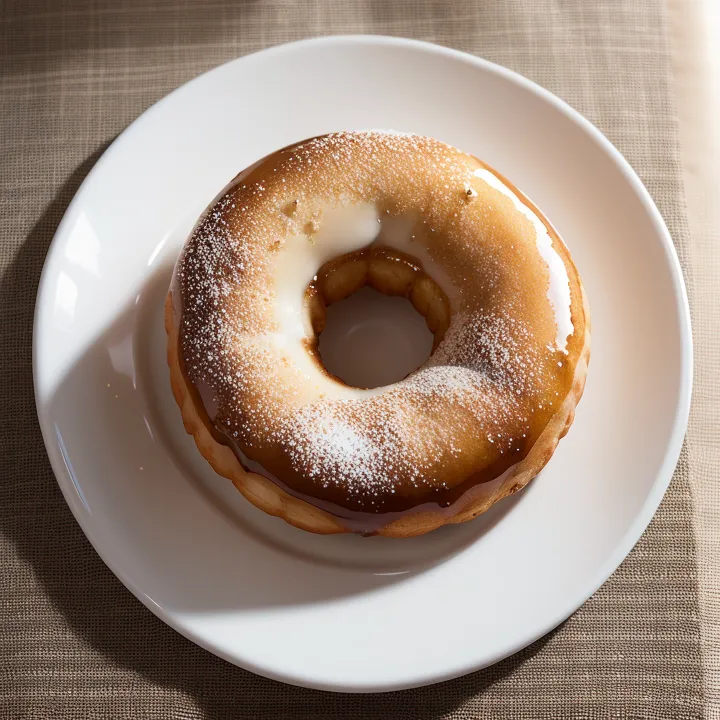

# pizza-clock/pizza-generator




## Prerequisites

- Python 3.11
- uv 0.5
- stable-diffusion-webui with sd-webui-controlnet configured
  - Recommended model: Photon (sd15)
- Ollama
  - Recommended model: gemini2:9b

## Run

```sh
# Install dependencies.
$ uv sync

# Show help.
$ uv run pizza_gen --help
Usage: pizza_gen [OPTIONS] COMMAND [ARGS]
... 
```

```sh
$ SD_SERVER=http://your-sd-webui-server:7860

# Generate an image of a pizza.
$ uv run pizza_gen pizza -s $SD_SERVER -o dist/ --num-pieces 1

# Generate an image of a pizza with a reference image.
$ uv run pizza_gen pizza -s $SD_SERVER -o dist/ --num-pieces 1 -g ref_images/pizza_12p_1p.webp

# Bulk generate images
$ seq 1 12 | xargs -t -I% uv run pizza_gen pizza -s $SD_SERVER -o dist/ --num-pieces % -g ref_images/pizza_12p_%p.webp
```

```sh
# Generate an image of something circular.
$ uv run pizza_gen circular -s $SD_SERVER -o dist/ -p "A photo of a coffee cup."

# Generate prompts with ollama.
$ uv run circular_prompt_gen -s http://your-ollama-server:11434 -o output.json
...
 thing='porcelain bowl' prompt="A photorealistic, close-up photograph of a pristine white porcelain bowl resting on a wooden table."

# Bulk generate images.
$ jq -c ".[]" circular_things.json | while read json;\
  do \
    T=$(echo $json | jq -r ".thing" | tr ' ' '_');\
    P=$(echo $json | jq .prompt);\
    uv run pizza_gen circular -s $SD_SERVER -o dist -p $P -t "circular_${T}_{INFO_HASH}";\
  done
```